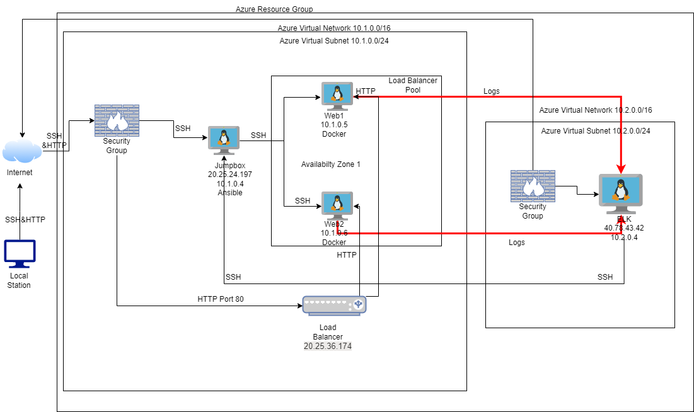
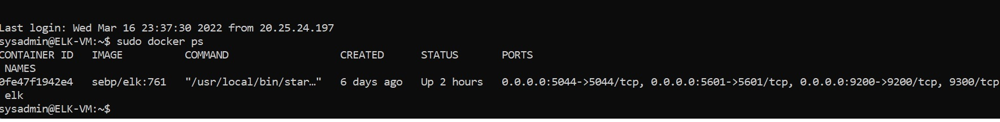

## Automated ELK Stack Deployment

The files in this repository were used to configure the network depicted below.

These files have been tested and used to generate a live ELK deployment on Azure. They can be used to either recreate the entire deployment pictured above. Alternatively, select portions of the respective playbook file may be used to install only certain pieces of it, such as Filebeat.
Link playbook files 

[Filebeat-config.yml](Ansible/filebeat-config.yml)

[filebeat-playbook.yml](Ansible/filebeat-playbook.yml)

[metricbeat-config.yml](Ansible/metricbeat-config.yml)

[metricbeat-playbook.yml](Ansible/metricbeat-playbook.yml)

This document contains the following details:
- Description of the Topology
- Access Policies
- ELK Configuration
  - Beats in Use
  - Machines Being Monitored
- How to Use the Ansible Build

### Description of the Topology

The main purpose of this network is to expose a load-balanced and monitored instance of DVWA, the D*mn Vulnerable Web Application.

Load balancing ensures that the application will be highly available, in addition to restricting access to the network.
- What aspect of security do load balancers protect? What is the advantage of a jump box?

 It provides one point entry and exit giving choke point for securing and confirguring the internet network from the external(generic internet)

Integrating an ELK server allows users to easily monitor the vulnerable VMs for changes to the network and system configuration.
- What does Filebeat watch for?

Filebeat watches for the file notifications and who accessed them 
- What does Metricbeat record?

Metricbeat takes the metrics and statistics that it collects and ships them to the output that you specify, such as Elasticsearch or Logstash. Metricbeat helps you monitor your servers by collecting metrics from the system and services running on the server.

The configuration details of each machine may be found below.

| Name     | Function | IP Address | Operating System |
|----------|----------|------------|------------------|
| Jump Box | Gateway  | 10.0.0.4 , 20.25.24.197  | Linux (ubuntu 18.04)|
| Web -1   | Traffic Monitoring|10.1.0.5|Linux (ubuntu 18.04)|
| Web-2|Traffic Monitoring|10.1.0.6| Linux (ubuntu 18.04)|
| Elk Server|Data Analytics Aggregation|10.2.0.4 , 40.78.43.42| Linux (ubuntu 18.04)|

### Access Policies

The machines on the internal network are not exposed to the public Internet. 

Only the _Jump box/Provisioner machine can accept connections from the Internet. Access to this machine is only allowed from the public real world IP addresses for the administrator through SSH (port22)

Machines within the network can only be accessed by the Jumpbox.
- Which machine did you allow to access your ELK VM? What was its IP address? 

We allowed the Jumpbox Provisioner within its corresponding ansible container ssh sysadmin@10.2.0.4

A summary of the access policies in place can be found in the table below.

| Name     | Publicly Accessible | Allowed IP Addresses |
|----------|---------------------|----------------------|
| Jump Box | Yes                 | my public IP|
| Web-1    | No                  |      IP of the jumpbox |
| Web-2    | No                  |  IP of the jumpbox     |
| Elk Server| Yes                | my public IP |

### Elk Configuration

Ansible was used to automate configuration of the ELK machine. No configuration was performed manually, which is advantageous because this reduces deployment time per container, allows for scalable deploment and eliminates manual configuration entry errors.
 The playbook implements the following tasks:
 
- Installs the following modules within the container:docker.io,pip3,
- Install Docker python module,
- Configures sysctl modules
- Sets the docker services to boot on docker start

The following screenshot displays the result of running `docker ps` after successfully configuring the ELK instance.

### Target Machines & Beats
This ELK server is configured to monitor the following machines:

- Web-1:10.1.0.5
- Web-2:10.1.0.6

We have installed the following Beats on these machines:
- Filebeats
- Metricbeats

These Beats allow us to collect the following information from each machine:
- Filebeats-collects data about the file system.
- Metricbeats- Collects machine metrics from your system and services.

### Using the Playbook
In order to use the playbook, you will need to have an Ansible control node already configured. Assuming you have such a control node provisioned: 

SSH into the control node and follow the steps below:
- Copy the filebeat.configuration file to ansible container.
- Update the configuration files to include correct IP addresses of the local IP address for the ELK Server (10.2.0.4:5601 and 10.2.0.4:9200) 
- Run the filebeat and metricbeat playbook, and navigate to the proper URL GUI of the ELK Server (http://40.78.43.42:5601/app/kibana#/home)to check if that the installation worked as expected.

The two playbook files we need to be concerned with are filebeat-playbook.yml and metricbeat-playbook.yml, both of these will need to be copied to the  /etc/ansible/roles directory on our ansible container on the jump box provioner.

We will need to update filebeat-config.yml and metricbeat-config.yml specifically on lines  1106 and 1806 using Ctrl W + the line number and add the ELK private IP address of 10.2.0.4 so that the deployment of the kibana monitor modules are deployed properly on the ELK server

#Line 1106- update the hosts IP address to your ELK servers private IP 
hosts: ["10.2.0.4:9200"]
username: "elastic"
password: "changeme" #:Change this to the password you set

#Line 1806 - perform the same as above
setup.kibabna:
host:"10.2.0.4:5601" #:Change this to the IP addresses of the ELK server

We need to update  the hosts file in the ansible container to show proper targets for deployment and monitoring for the ELK server

[webservers] 
10.1.0.5 ansible_python_interpreter=/usr/bin/python3
10.1.0.6 ansible_python_interpreter=/usr/bin/python3

[elk]
10.2.0.4 ansible_python_interpreter=/usr/bin/python3

Once all of the configurations have been set up run the following commands from the ansible container:
ansible-playbook filebeat-playbook.yml
ansible-playbook metricbeat-playbook.yml
If the deployment has run successfully you should be able to head to
http://40.78.43.42:5601/app/kibana#/home and kibana should come up in your web browser 

